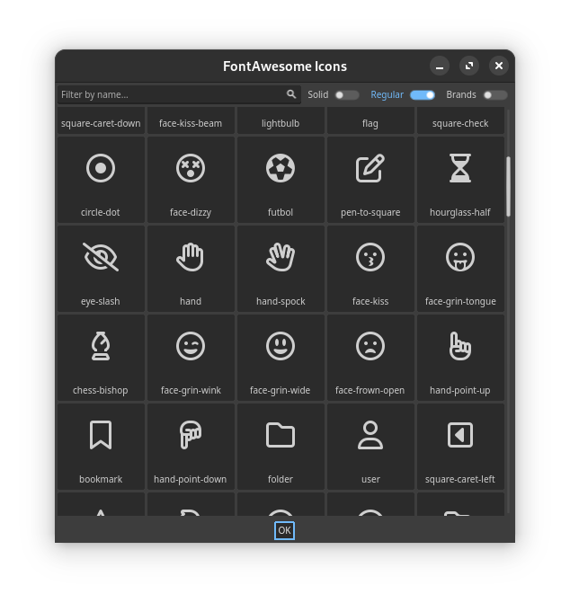

# FontAwesome plugin for Godot

Use [FontAwesome](https://fontawesome.com) 6.0 on Godot 4.0!

## Usage

Create a new "FontAwesome" Node and configure it's values. To change color, simply go to theme overrides and change the font color.

All icons can be found under **Project > Tools > FontAwesome Icons**.

## Updating

Simply copy new [FontAwesome](https://fontawesome.com) `.woff2` fonts in `addons/fontawesome/fonts` and copy `all.min.js` in utils, then open `dump_eet.html`. Copy the output and paste on `All.gd`

If a new version of fontawesome comes out it will be updated on a new branch.
